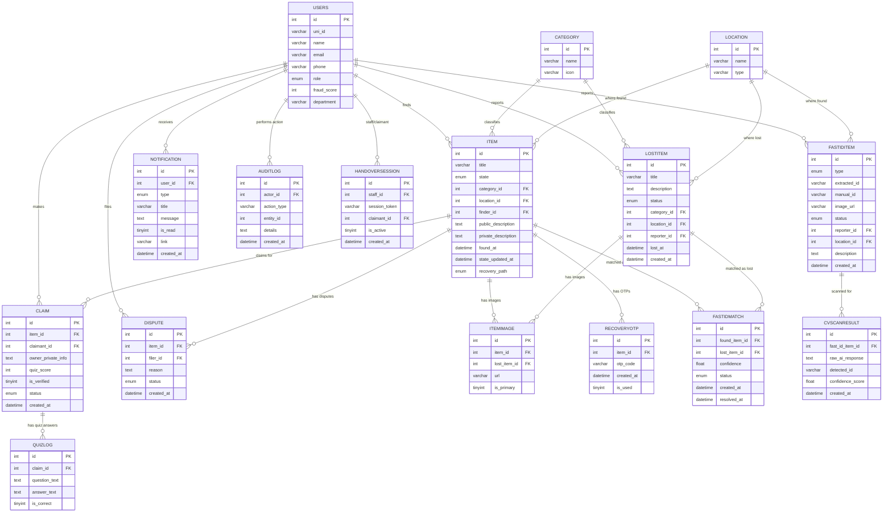

# Find-X Database ERD

This document contains the Entity Relationship Diagram (ERD) for the Find-X system, extracted from the provided schema image.

## Mermaid ERD

```mermaid
erDiagram
    USERS ||--o{ ITEM : "finds"
    USERS ||--o{ LOSTITEM : "reports"
    USERS ||--o{ CLAIM : "makes"
    USERS ||--o{ NOTIFICATION : "receives"
    USERS ||--o{ AUDITLOG : "performs action"
    USERS ||--o{ HANDOVERSESSION : "staff/claimant"
    USERS ||--o{ FASTIDITEM : "reports"
    USERS ||--o{ DISPUTE : "files"

    CATEGORY ||--o{ ITEM : "classifies"
    CATEGORY ||--o{ LOSTITEM : "classifies"

    LOCATION ||--o{ ITEM : "where found"
    LOCATION ||--o{ LOSTITEM : "where lost"
    LOCATION ||--o{ FASTIDITEM : "where found"

    ITEM ||--o{ CLAIM : "claims for"
    ITEM ||--o{ ITEMIMAGE : "has images"
    ITEM ||--o{ RECOVERYOTP : "has OTPs"
    ITEM ||--o{ DISPUTE : "has disputes"
    ITEM ||--o{ FASTIDMATCH : "matched as found"

    LOSTITEM ||--o{ ITEMIMAGE : "has images"
    LOSTITEM ||--o{ FASTIDMATCH : "matched as lost"

    CLAIM ||--o{ QUIZLOG : "has quiz answers"

    FASTIDITEM ||--o{ CVSCANRESULT : "scanned for"

    USERS {
        int id PK
        varchar uni_id
        varchar name
        varchar email
        varchar phone
        enum role
        int fraud_score
        varchar department
    }

    ITEM {
        int id PK
        varchar title
        enum state
        int category_id FK
        int location_id FK
        int finder_id FK
        text public_description
        text private_description
        datetime found_at
        datetime state_updated_at
        enum recovery_path
    }

    LOSTITEM {
        int id PK
        varchar title
        text description
        enum status
        int category_id FK
        int location_id FK
        int reporter_id FK
        datetime lost_at
        datetime created_at
    }

    CATEGORY {
        int id PK
        varchar name
        varchar icon
    }

    LOCATION {
        int id PK
        varchar name
        varchar type
    }

    CLAIM {
        int id PK
        int item_id FK
        int claimant_id FK
        text owner_private_info
        int quiz_score
        tinyint is_verified
        enum status
        datetime created_at
    }

    ITEMIMAGE {
        int id PK
        int item_id FK
        int lost_item_id FK
        varchar url
        tinyint is_primary
    }

    NOTIFICATION {
        int id PK
        int user_id FK
        enum type
        varchar title
        text message
        tinyint is_read
        varchar link
        datetime created_at
    }

    AUDITLOG {
        int id PK
        int actor_id FK
        varchar action_type
        int entity_id
        text details
        datetime created_at
    }

    QUIZLOG {
        int id PK
        int claim_id FK
        text question_text
        text answer_text
        tinyint is_correct
    }

    HANDOVERSESSION {
        int id PK
        int staff_id FK
        varchar session_token
        int claimant_id FK
        tinyint is_active
        datetime created_at
    }

    RECOVERYOTP {
        int id PK
        int item_id FK
        varchar otp_code
        datetime created_at
        tinyint is_used
    }

    FASTIDITEM {
        int id PK
        enum type
        varchar extracted_id
        varchar manual_id
        varchar image_url
        enum status
        int reporter_id FK
        int location_id FK
        text description
        datetime created_at
    }

    CVSCANRESULT {
        int id PK
        int fast_id_item_id FK
        text raw_ai_response
        varchar detected_id
        float confidence_score
        datetime created_at
    }

    FASTIDMATCH {
        int id PK
        int found_item_id FK
        int lost_item_id FK
        float confidence
        enum status
        datetime created_at
        datetime resolved_at
    }

    DISPUTE {
        int id PK
        int item_id FK
        int filer_id FK
        text reason
        enum status
        datetime created_at
    }
```
